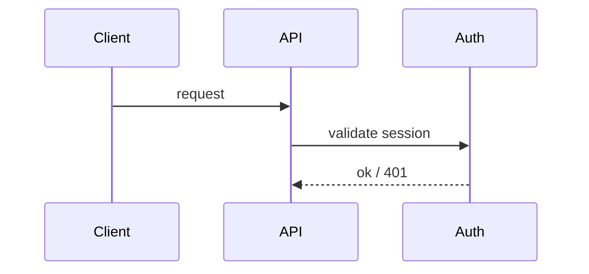

<!--
World-class page skeleton. Delete sections that do not apply to this page's
Diátaxis mode — do not pad. Lead with the job-to-be-done, link to source lines,
capture intent and flow, never paraphrase function bodies.
-->

# <Title>

> One sentence: what this system does and why a reader is here.

## In one read

The job-to-be-done framing: what a reader can do or understand after this page.
Two or three sentences, not a definition dump.

## How it works

The flow and the *why*. Link claims to source: see `src/auth/session.ts:42`.
Every architectural assertion here must survive the accuracy oracle — if you
cannot point a skeptic at the lines, cut it or mark it `unverified`.

## Key pieces

- **`<Symbol / module>`** (`path:line`) — what it owns, its boundary.

## Why it is shaped this way

Non-obvious decisions and trade-offs, each with a source (commit, ADR, comment).
Unsourced rationale is a guess — drop it or find the source. This is the
highest-value, lowest-supply section; do not skip it when the *why* is real.

## See also

- [<Related page>](../<section>/<page>.md) — cross-links the navigability oracle
  exercises; point the reader where they go next.
